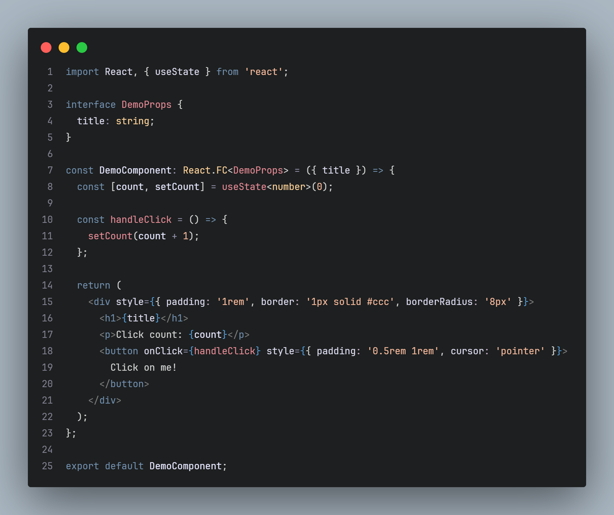

# Ember & Ash

A minimalist dark theme for VS Code inspired by glowing embers and cooling ash. 

## Features
- **Ember Accents:** Warm salmon tones for functions and strings.
- **Ashen Background:** Deep slate grey background to reduce eye strain.
- **Sage Comments:** Muted green-grey comments for a natural, non-distracting look.

## Preview
